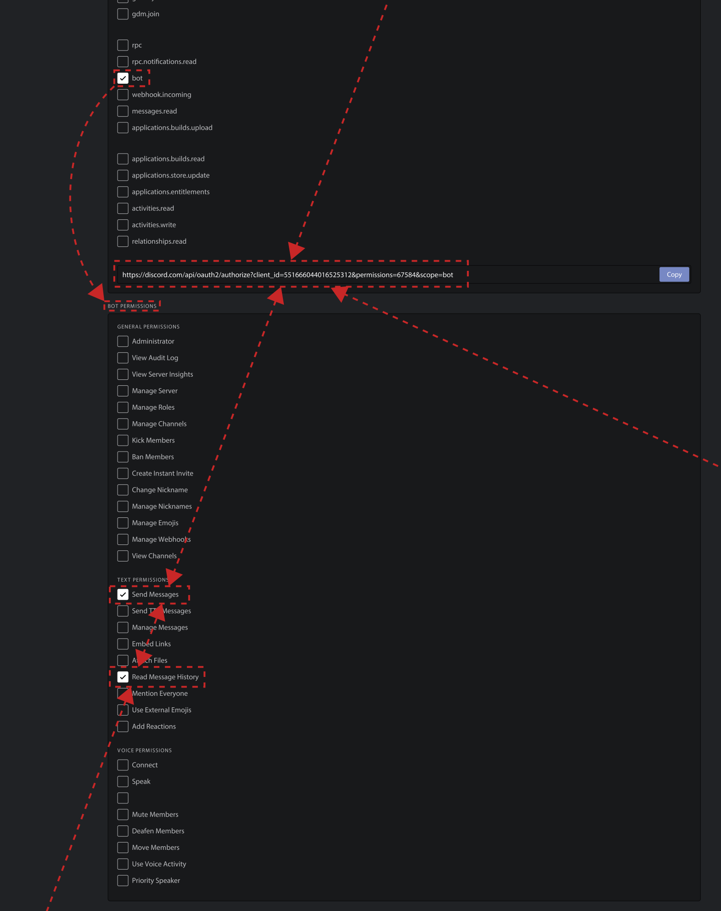

# Mav Jav Education bot

<a href="https://discord.gg/KzzTBbr" alt="Discord server invite"></a>
<a href="https://pypi.python.org/pypi/discord.py"><object data="https://img.shields.io/pypi/v/discord.py.svg" type="image/svg+xml" alt="PyPI version info" height="20vh" align="initial"></object></a>
   
[Mav Jav Education Discord server](https://discord.gg/KzzTBbr) bot. 

This project uses [Rapptz/discord.py](https://github.com/Rapptz/discord.py) to implement a [Discord](HTTPS://discord.gg) server bot. This bot is meant to be used as an educational tool to teach Python programming to kids🦸🏼‍♀️🦸🏼‍♂️🦸🏽‍♀️🦸🏽‍♂️ grades 7-12<sup id="a1">[1](#f1)</sup>. The bot is occassionally deployed on [Mav Jav Education Discord server](https://discord.gg/KzzTBbr) for testing.

## Build

The purpose of this bot is to motivate kids to learn to code.

My bot is not a "public bot", so it cannot be added by invitation within Discord. However, I hope kids will assemble and deploy this bot using their own computer to get an idea of how to create their own Python-powered bot on their Discord servers.

To try this, you will need some set up.

### Prerequisites

- Shell familiarity (<a href="https://www.guru99.com/powershell-tutorial.html"><object data="https://raw.githubusercontent.com/mr-robot9/RovEverywhere/9a69cdddcbc50dae7014920a1f8ace9f6f399ed1/public/fontawesome-free-5.0.7/advanced-options/raw-svg/brands/windows.svg" type="image/svg+xml" alt="Windows 10 Logo" height="12vh" align="initial"></object></a>, <a href="https://www.bash.academy/"><object data="https://raw.githubusercontent.com/brandonmaul/brandonmaul.github.io/dc9ec94fac737539b038ed92b739dc23b6e0a3e0/vendor/fontawesome-free/svgs/brands/linux.svg" type="image/svg+xml" alt="Linus logo" height="12vh" align="initial"></object></a>, <a href="https://tidbits.com/2019/12/08/resources-for-adapting-to-zsh-in-catalina/"><object data="https://raw.githubusercontent.com/BrandonRush/infodump/34d1ff5d30b9f3a2ffb16f350e94d536315fd0a8/assets/os/macos.svg" type="image/svg+xml" alt="macOS Logo" height="12vh" align="initial"></object></a>),
- [VS Code](https://code.visualstudio.com
)
- [Git](https://marketplace.visualstudio.com/items?itemName=donjayamanne.git-extension-pack),
- [Python](https://marketplace.visualstudio.com/items?itemName=donjayamanne.python-extension-pack),
- [Understand](https://code.visualstudio.com/docs/python/python-tutorial) how to run Python in VS Code,
- [discord.py](https://pypi.org/project/discord.py/) module,
- Fernet [cryptography](https://pypi.org/project/cryptography/) module,
- Understand Python [venv](https://realpython.com/python-virtual-environments-a-primer/)

### Deploy

To actually get this code running, follow these 10 steps:

1. Clone this repository in VS Code ([how?](https://youtu.be/F2DBSH2VoHQ))
2. Enter the `discordpy` directory using a command shell (how <a href="https://docs.microsoft.com/en-us/powershell/module/microsoft.powershell.management/set-location?view=powershell-7"><object data="https://raw.githubusercontent.com/mr-robot9/RovEverywhere/9a69cdddcbc50dae7014920a1f8ace9f6f399ed1/public/fontawesome-free-5.0.7/advanced-options/raw-svg/brands/windows.svg" type="image/svg+xml" alt="Windows 10 Logo" height="12vh" align="initial"></object></a>, <a href="http://linuxcommand.org/lc3_lts0010.php"><object data="https://raw.githubusercontent.com/brandonmaul/brandonmaul.github.io/dc9ec94fac737539b038ed92b739dc23b6e0a3e0/vendor/fontawesome-free/svgs/brands/linux.svg" type="image/svg+xml" alt="Linus logo" height="12vh" align="initial"></object></a>, <a href="https://macpaw.com/how-to/use-terminal-on-mac"><object data="https://raw.githubusercontent.com/BrandonRush/infodump/34d1ff5d30b9f3a2ffb16f350e94d536315fd0a8/assets/os/macos.svg" type="image/svg+xml" alt="macOS Logo" height="12vh" align="initial"></object></a>)
3. Activate the Python virtual environment `discordpy`
   ([how macOS/Linux](https://youtu.be/Kg1Yvry_Ydk), [how Windows](https://youtu.be/APOPm01BVrk)),
   

```powershell
.\discordpy\Scripts\activate.bat
```
or
```bash
./discordpy/Scripts/activate
```
4. Get a token from Discord
   1. Go to the [Discord developers' applications page](https://discord.com/developers/applications/)
   2. Create an application or click the application you created for this bot
   3. Click the 'Bot' tab with puzzle piece <object data="https://raw.githubusercontent.com/mavaddat-javid-education/discordpy/master/bot.svg" type="image/svg+xml" alt="'Bot' tab on Discord developer's application" height="20vh" align="initial"></object></a> icon 
   4. Click 'Copy' under 'TOKEN' 
5. Create your Fernet `token` and `key` by pasting the auth token into Python shell running [writeToken.py](writeToken.py) script
6. Go to the OAuth2 tab 
7. Check the box for `bot` role 
8. Check boxes for the permissions `Send Messages` and `Read Message History` 
9. Invite your bot to join your server  (Your bot won't actually appear until the last step, [10](#10)
10. Run the [discordbot](discordbot.py) on your computer inside VS Code

That's it! The bot is now running on your server.

## TODO

This repository is a work-in-progress. I still need to add the following to the README.

- [x] Explain prerequisites to start
- [x] Instructions on how to deploy bot
- [ ] Explain features of the bot
- [ ] Explain how to add your own features
- [ ] Multilingual translations

<b id="f1">1</b> To use <a href="https://en.wikipedia.org/wiki/Discord">Discord</a>, students must be  <i>same age or older</i> than <u>the age of digital consent</u>, which is 13 in Canada and USA. If you are not thirteen years old (13) yet, please seek your guardian's or parents' assistance. Your guardian or parents can sign up for Discord and help you get your bot going.[↩](#a1)
