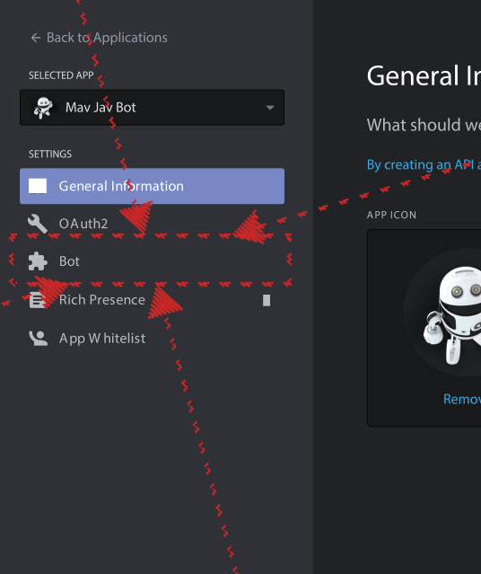
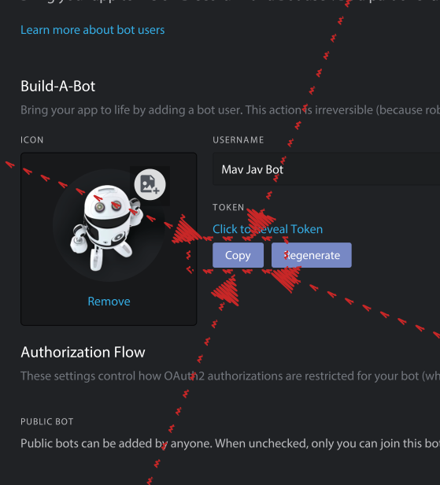
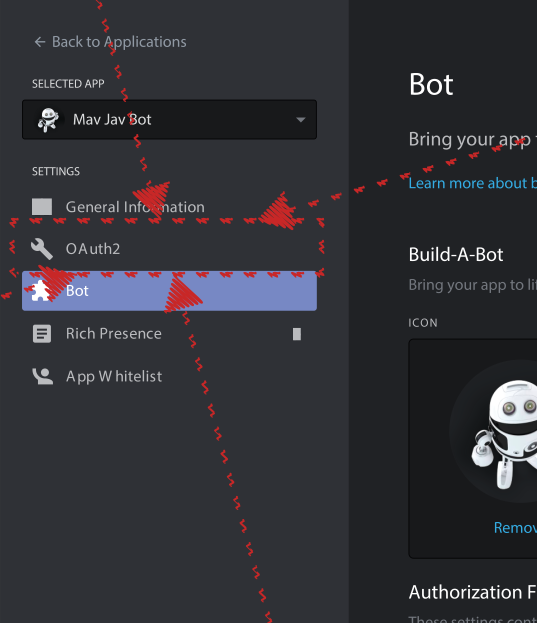

# Mav Jav Education bot

<a href="https://discord.gg/KzzTBbr" alt="Discord server invite"></a>
<a href="https://pypi.python.org/pypi/discord.py"><object data="https://img.shields.io/pypi/v/discord.py.svg" type="image/svg+xml" alt="PyPI version info" height="20vh" align="initial"></object></a>
   [](https://saythanks.io/to/javid@mavaddat.ca)

[Mav Jav Education Discord server](https://discord.gg/KzzTBbr) bot. 

This project uses [Rapptz/discord.py](https://github.com/Rapptz/discord.py) to implement a [Discord](HTTPS://discord.gg) server bot. This bot is meant to be used as an educational tool to teach Python programming to kids🦸🏼‍♀️🦸🏼‍♂️🦸🏽‍♀️🦸🏽‍♂️ grades 7-12<sup id="a1">[1](#f1)</sup>. The bot is occassionally deployed on [Mav Jav Education Discord server](https://discord.gg/KzzTBbr) for testing.

## Features

1. Simple message-response

   The [code](discordbot.py) includes templates for how to create commands that the bot recognizes and will respond to.

2. A timer function to remind the chat of a message after a specified time. This is achieved using multithreaded function calls to enable asynchronous input/output, allowing our bot to do work in the background without freezing up (being unresponsive to further commands until it finishes the work).
3. Subcommands. This demonstrates multiple variations on a central command (e.g., `!playMusic`, `!playSong`, `!playArtist`, `!playMovie`, `!playYouTube` all have the root `!play` followed by some target)

## Deploy

The purpose of this bot is to motivate kids to learn to code.

My bot is not a "public bot" (unlike the bots you're familiar with), so it cannot be added by invitation. However, you can assemble and deploy this bot using your own computer to get an idea of how to create your own Python-powered bot on your Discord servers.

To try this, you will need some set up. If necessary, platform-specific instructions are given as links by major operating systems' icons: <a  alt="Windows 10 Logo"><object data="https://raw.githubusercontent.com/mr-robot9/RovEverywhere/9a69cdddcbc50dae7014920a1f8ace9f6f399ed1/public/fontawesome-free-5.0.7/advanced-options/raw-svg/brands/windows.svg" type="image/svg+xml" alt="Windows 10 Logo" height="12vh" align="initial"></object></a> for Windows, <a alt="Linux logo" ><object data="https://raw.githubusercontent.com/brandonmaul/brandonmaul.github.io/dc9ec94fac737539b038ed92b739dc23b6e0a3e0/vendor/fontawesome-free/svgs/brands/linux.svg" type="image/svg+xml" alt="Linux logo" height="12vh" align="initial"></object></a> for Linux, and <a alt="macOS Logo" ><object data="https://raw.githubusercontent.com/BrandonRush/infodump/34d1ff5d30b9f3a2ffb16f350e94d536315fd0a8/assets/os/macos.svg" type="image/svg+xml" alt="macOS Logo" height="12vh" align="initial"></object></a> for macOS. At each step, please judge for yourself whether you're missing knowledge to complete that step. If you think you need to learn, please click the icon that matches your operating system to learn more about that step.

### Prerequisites

- 🎓 Shell familiarity (<a href="https://www.guru99.com/powershell-tutorial.html"><object data="https://raw.githubusercontent.com/mr-robot9/RovEverywhere/9a69cdddcbc50dae7014920a1f8ace9f6f399ed1/public/fontawesome-free-5.0.7/advanced-options/raw-svg/brands/windows.svg" type="image/svg+xml" alt="Windows 10 Logo" height="12vh" align="initial"></object></a>, <a href="https://www.bash.academy/"><object data="https://raw.githubusercontent.com/brandonmaul/brandonmaul.github.io/dc9ec94fac737539b038ed92b739dc23b6e0a3e0/vendor/fontawesome-free/svgs/brands/linux.svg" type="image/svg+xml" alt="Linus logo" height="12vh" align="initial"></object></a>, <a href="https://tidbits.com/2019/12/08/resources-for-adapting-to-zsh-in-catalina/"><object data="https://raw.githubusercontent.com/BrandonRush/infodump/34d1ff5d30b9f3a2ffb16f350e94d536315fd0a8/assets/os/macos.svg" type="image/svg+xml" alt="macOS Logo" height="12vh" align="initial"></object></a>),
- [ VS Code](https://code.visualstudio.com
)
- [ Git](https://marketplace.visualstudio.com/items?itemName=donjayamanne.git-extension-pack),
- [ Python](https://marketplace.visualstudio.com/items?itemName=donjayamanne.python-extension-pack),
- 🎓 [Understand](https://code.visualstudio.com/docs/python/python-tutorial) how to run Python in VS Code,
- [ discord.py](https://pypi.org/project/discord.py/) module,
-  Fernet [cryptography](https://pypi.org/project/cryptography/) module,
- 🎓 Understand Python [venv](https://realpython.com/python-virtual-environments-a-primer/)

### Run ▶

To actually get this code running, follow these 10 steps:

1. Clone this repository in VS Code ([how?](https://youtu.be/F2DBSH2VoHQ))
2. Enter the `discordpy` directory using a command shell (how <a href="https://docs.microsoft.com/en-us/powershell/module/microsoft.powershell.management/set-location?view=powershell-7"><object data="https://raw.githubusercontent.com/mr-robot9/RovEverywhere/9a69cdddcbc50dae7014920a1f8ace9f6f399ed1/public/fontawesome-free-5.0.7/advanced-options/raw-svg/brands/windows.svg" type="image/svg+xml" alt="Windows 10 Logo" height="12vh" align="initial"></object></a>, <a href="http://linuxcommand.org/lc3_lts0010.php"><object data="https://raw.githubusercontent.com/brandonmaul/brandonmaul.github.io/dc9ec94fac737539b038ed92b739dc23b6e0a3e0/vendor/fontawesome-free/svgs/brands/linux.svg" type="image/svg+xml" alt="Linus logo" height="12vh" align="initial"></object></a>, <a href="https://macpaw.com/how-to/use-terminal-on-mac"><object data="https://raw.githubusercontent.com/BrandonRush/infodump/34d1ff5d30b9f3a2ffb16f350e94d536315fd0a8/assets/os/macos.svg" type="image/svg+xml" alt="macOS Logo" height="12vh" align="initial"></object></a>)
3. Activate the Python virtual environment `discordpy`
   ([how macOS/Linux](https://youtu.be/Kg1Yvry_Ydk), [how Windows](https://youtu.be/APOPm01BVrk)),

```powershell
.\discordpy\Scripts\activate.bat
```

or

```bash
./discordpy/Scripts/activate
```

4. Get a token from Discord
   1. Go to the [Discord developers' applications page](https://discord.com/developers/applications/)
   2. Create an application or click the application you created for this bot
   3. Click the 'Bot' tab with puzzle piece <object data="https://raw.githubusercontent.com/mavaddat-javid-education/discordpy/master/discordPuzzle.svg" type="image/svg+xml" alt="'Bot' tab on Discord developer's application" height="20vh" align="initial"></object></a> icon 
   4. Click 'Copy' under 'TOKEN' 
5. Create your Fernet `token` and `key` by pasting the auth token into Python shell running [writeToken.py](writeToken.py) script<sup id="a2">[2](#f2)</sup>
6. Go to the OAuth2 tab 
7. Check the box for `bot` role 
8. Check boxes for the permissions `Send Messages` and `Read Message History` to generate a URL inivitation 
9. Invite your bot to join your server by copying the URL generated by the permissions calculating tool in step [8](#8). The URL will have the format `https://discord.com/api/oauth2/authorize?client_id=`{CLIENT_ID}`&permissions=`{PERMISSIONS_NUMBER}`&scope=bot`  (Your bot won't actually appear in your server until the last step, [10](#10))
10. Run the [discordbot](discordbot.py) on your computer inside VS Code ([how?](https://code.visualstudio.com/docs/editor/debugging))

That's it! The bot now should be running on your server.


## TODO

This repository is a work-in-progress. I still need to add the following to the README.

- [x] ~~Explain prerequisites to start~~
- [x] ~~Instructions on how to deploy bot~~
- [x] ~~Explain features of the bot~~
- [ ] Explain how to add your own features
- [ ] Explain remote `server`, local `computer`, multithreading, asynchronous
- [ ] Security principles motivating encryption, least privilege
- [ ] SVG recording of `bash` and `PowerShell` demonstrating each step
- [ ] Add functionality of Discord.py
  - [ ] Connect to MySQL db 
  - [ ] Welcome message 
  - [ ] Moderation
  - [ ] Auto role
  - [ ] Twitch, YouTube, Reddit, Mixer alerts
  - [ ] Pokémon catching 
  - [ ] Accept donations
  - [ ] Meme maker
  - [ ] Mini games
    - Trivia games
       - Music trivia
       - Gaming trivia
  - [ ] Member levels and XP
  - [ ] Role rewards
  - [ ] Play music/videos
    - YouTube • Tracks, Playlists, Searches, Links, Streams
    - SoundCloud • Tracks, Playlists, Searches, Links
    - Spotify • Links to tracks, Playlists
    - Twitch • Links to streams
    - Mixer • Links to streams
    - BandCamp • Links to tracks and albums
  - [ ] Pull stats from https://tracker.gg/
    - Apex Legends
    - CSGO
    - Division 2
    - Overwatch
    - Splitgate
    - Fortnite Power Rankings
- [ ] Multilingual translations

[<b id="f1">1</b>](#a1) To use [Discord](https://en.wikipedia.org/wiki/Discord), students must be *same age or older than* the age of digital consent, which is 13 in Canada and USA. If you are not thirteen years old (13) yet, please seek your guardian's or parents' assistance. Your guardian or parents can sign up for Discord and help you get your bot going.[↩](#a1)

[<b id="f2">2</b>](#a2) This step will encrypt the OAuth token so that it can be securely stored locally. The `writeToken.py` script also attempts to append the `.gitignore` manifest so that we do not upload the `token` or `key` file onto our repository. These must be kept secret. Anyone who has the key can decrypt the token, but having the encrypted token will be useless (that is the purpose of encryption). <br/> Ideally, we would not keep the key in the same location as the encrypted file, but our purpose here is to demonstrate the method of encryption. Future releases of this code will use [jaraco/keyring](https://github.com/jaraco/keyring) to store and retrieve the key securely from the system credential manager or keychain.[↩](#a2)
